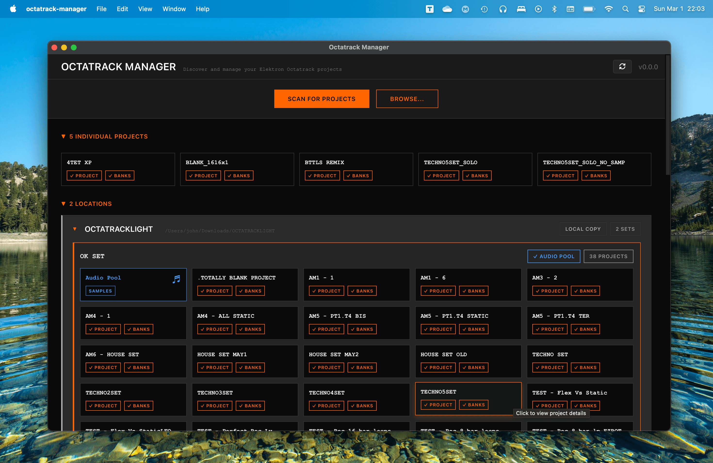

# Octatrack Manager

**Octatrack Manager** is a task-oriented desktop application designed to simplify the management of your Elektron Octatrack projects. It provides a powerful and intuitive interface for browsing, inspecting, and editing your projects away from the hardware.

<p align="center">
  
</p>

<p align="center" style="display: flex; justify-content: center; align-items: center; gap: 10px;">
  <a href="https://davidferlay.github.io/octatrack-manager/" target="_blank">
    <strong>Read the User Guide</strong>
  </a>
  <span> | </span>
  <a href="https://www.elektronauts.com/t/project-manager-for-octatrack/233672" target="_blank">
    <strong>Join the Discussion on Elektronauts</strong>
  </a>
</p>

<p align="center">
  <a href="https://www.buymeacoffee.com/octatrackmanager" target="_blank">
    
  </a>
</p>

## Key Features

- **Project Discovery:** Automatically scan CF cards, USB drives, and local backups to find your Sets and projects.
- **In-Depth Inspection:** View mixer settings, MIDI configuration, memory allocation, and metronome settings at a glance.
- **Pattern Visualization:** Explore every step of your sequences, including micro-timing, trig conditions, and chord information for MIDI tracks.
- **Audio Pool Management:** Browse your samples with detailed metadata and transfer files with **automatic WAV conversion** (44.1 kHz resampling).
- **Parts Editor:** Modify sound design snapshots for both audio and MIDI tracks, including machine parameters, effects, and a custom **LFO Designer**.
- **Bulk Operations:** Powerful tools for copying banks, parts, patterns, and sample slots between projects.


## Active Development

Octatrack Manager is currently a **work in progress**. New functionalities are being added regularly to expand its capabilities.

We are constantly working to improve the application and add more power-user features. Your feedback and bug reports are essential to the project's growth.


## Documentation

For detailed instructions, troubleshooting, and feature explanations, please visit the official documentation:

- **[davidferlay.github.io/octatrack-manager](https://davidferlay.github.io/octatrack-manager/)**


## Installation

1. Download the latest release for your platform (Windows, macOS, or Linux) from the [Releases page](https://github.com/davidferlay/octatrack-manager/releases/latest).
2. Follow the [Installation Guide](https://davidferlay.github.io/octatrack-manager/docs/getting-started/installation) for platform-specific steps, especially for **macOS Gatekeeper** bypass.


## Compatibility

- This application is only compatible with projects saved on **Octatrack OS 1.40 or later**.
- Projects from older versions must be opened and re-saved on the hardware first.


## Contributing & Feedback

Feedback from the community is invaluable. Please share your experiences, bug reports, and ideas:

- **Elektronauts:** [Project Manager for Octatrack Thread](https://www.elektronauts.com/t/project-manager-for-octatrack/233672)
- **GitHub:** [Issues Page](https://github.com/davidferlay/octatrack-manager/issues)


## Development

If you'd like to build the project locally:

```bash
git clone https://github.com/davidferlay/octatrack-manager.git
cd octatrack-manager
npm install
npm run tauri:dev
```

## Credits & Tech Stack

Built with:
- [ot-tools-io](https://gitlab.com/ot-tools/ot-tools-io) - Octatrack file I/O library
- [Tauri](https://tauri.app/) - Desktop application framework
- [React](https://react.dev/) - UI framework
- [Vite](https://vitejs.dev/) - Frontend build tool

