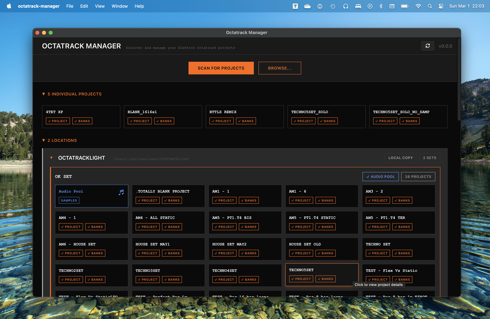

# Octatrack Manager

A desktop application for managing Elektron Octatrack projects, built with Tauri and React.

<p align="center">
  
</p>
<p align="center" style="display: flex; justify-content: center; align-items: center; gap: 10px;">
  <a href="https://www.buymeacoffee.com/octatrackmanager" target="_blank">
    
  </a>
  <a href="https://www.elektronauts.com/t/project-manager-for-octatrack/" target="_blank">
    
  </a>
</p>

## Features

- **Sets Discovery**: Automatically scan for Octatrack CF cards and local backups
- **Project Management**: Browse and edit Octatrack Sets with audio pool and project information
- **Audio Pool**: Browse, convert and mmanage the shared sample libraries
- **Cross-Platform**: Works on Linux, macOS, and Windows

## Documentation

- Full user guide: **[davidferlay.github.io/octatrack-manager](https://davidferlay.github.io/octatrack-manager/)**


## Installation

- Download the latest release for your platform from the [Releases page](https://github.com/davidferlay/octatrack-manager/releases).
- See the [installation guide](https://davidferlay.github.io/octatrack-manager/docs/getting-started/installation) for platform-specific instructions.


## Contributing

- Feedbacks are welcome! Feel free to share comments, ideas, feature requests to [Elektronauts thread](https://www.elektronauts.com/t/project-manager-for-octatrack/) and shape the future of this project !


## Compatibility

- **Important**: This project is only compatible with projects that are created/saved on the latest OS (i.e. 1.40X).

- For projects saved from another version, re-open and re-save that project with the OS on the latest version.

## Development

```bash
git clone https://github.com/davidferlay/octatrack-manager.git
cd octatrack-manager
npm install
npm run tauri:dev
```

## Credits

Built with:
- [ot-tools-io](https://gitlab.com/ot-tools/ot-tools-io) - Octatrack file I/O library
- [Tauri](https://tauri.app/) - Desktop application framework
- [React](https://react.dev/) - UI framework
- [TypeScript](https://www.typescriptlang.org/) - Type-safe JavaScript
- [Vite](https://vitejs.dev/) - Frontend build tool


